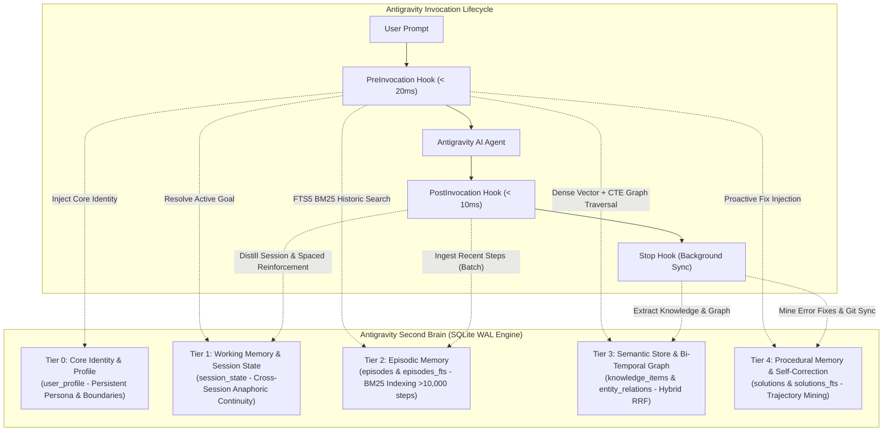

# 🧠 Antigravity Second Brain: Enterprise Multi-Platform Cognitive Architecture

[%20%7C%20WSL2-blue.svg)](https://github.com/TranVu-2005/antigravity-second-brain)
[](https://github.com/TranVu-2005/antigravity-second-brain/actions)
[-green.svg)](https://nodejs.org)
[-orange.svg)](https://sqlite.org)
[-purple.svg)](https://github.com/qdrant/fastembed)
[-black.svg)](#-engineering-philosophy--security)
[](LICENSE)

**Antigravity Second Brain** is an autonomous, production-grade cognitive long-term memory engine engineered specifically for the **Antigravity AI Agent**. It operates as an ephemeral, zero-overhead memory injection layer that preserves agent identity, retains technical architectural decisions (ADRs), indexes complete conversational history, and autonomously learns from terminal error resolutions (Procedural Memory & Self-Correction).

Designed under the **Universal Multi-Platform Standard**, it ensures seamless, continuous cognitive parity across **Windows 11** and **Linux distributions (Ubuntu, Debian, Fedora, Arch, WSL2)**.

---

## 🏛️ Cognitive Architecture: The 5-Tier Memory Hierarchy



### Cognitive Tiers Breakdown

* **Tier 0: Core Identity & User Profile (`user_profile`):**
  Maintains master identity, honorifics ("Ngài" / Sir), communication style, physical location, hardware specifications, and the Absolute Honesty Policy. Automatically compiled into a high-density, token-budgeted prompt header before every turn.
* **Tier 1: Working Memory & Session State (`session_state`):**
  Tracks active objectives (`active_goal`), working directories, and cross-session context continuity. Enables anaphoric resolution and spaced cognitive reinforcement during session distillation.
* **Tier 2: Episodic Memory (`conversations`, `episodes`, `episodes_fts`):**
  High-speed batch transaction parser and full-text search engine powered by SQLite FTS5 with BM25 ranking, indexing over 11,000 interaction turns across 165+ historical sessions (< 20ms).
* **Tier 3: Semantic Knowledge Store & Bi-Temporal Knowledge Graph:**
  Long-term knowledge repository utilizing **True Hybrid Search**—fusing Sparse BM25 and 384-dimensional Dense Multilingual Transformer Vectors. Accompanied by a Bi-Temporal Knowledge Graph supporting SQLite Recursive CTE 2-hop traversal.
* **Tier 4 & 4.5: Procedural Memory & Self-Correction Engine (`solutions`):**
  Case-based reasoning store recording technical fixes, shell idioms, and operational recipes. Autonomously inspects terminal execution transcripts to capture failed commands followed by successful remediation.

---

## 📂 Repository Directory Layout

```
antigravity-second-brain/
├── .github/                    # GitHub Community standards & templates
│   ├── ISSUE_TEMPLATE/         # Structured YAML bug & feature templates
│   └── PULL_REQUEST_TEMPLATE.md# Production PR checklist & verification gate
├── ci/                         # Cross-platform matrix CI workflow template
│   └── ci.yml                  # Matrix CI: Ubuntu & Windows on Node 22 & 24
├── db/
│   └── schema.sql              # Production schema: WAL pragmas, FTS5, Bi-Temporal graph
├── templates/                  # Generic, sanitized templates for clean installations
│   ├── profile.template.json   # Identity & Persona generic template
│   └── seed.sql                # Clean initial schema & knowledge seed
├── exports/                    # [DECOUPLED] Private Data Store (antigravity-second-brain-data)
│   ├── dump.sql                # Complete idempotent SQL dump (INSERT OR REPLACE)
│   ├── profile.json            # User profile snapshot
│   ├── knowledge.json          # Semantic knowledge items
│   ├── solutions.json          # Procedural error solutions
│   ├── episodes_log.json       # Full conversation episodes
│   ├── entities.json           # Knowledge graph entities
│   └── conversations_summary.json
├── hooks/                      # Direct Antigravity Lifecycle Hook integrations
│   ├── pre_invocation.js       # Dynamic context retrieval & background sync launcher
│   ├── post_invocation.js      # Zero-lag episodic ingestion & session distillation
│   └── stop.js                 # Throttled auto-backup, snapshot exporter & git sync
├── integrations/               # Distribution templates for new environments
│   ├── hooks.json              # Hook registration template with {{BRAIN_DIR}}
│   ├── mcp_config.json         # Sanitized MCP server config template
│   ├── mcp_schemas/            # 14 RFC-compliant MCP Tool schemas
│   └── skills/                 # Second Brain native skill definition
├── scripts/                    # Platform utilities & security audits
│   ├── security_check.js       # Pre-commit zero-shell-injection audit runner
│   ├── lint.js                 # Zero-dependency syntax validator (node --check)
│   ├── auto_backup.sh          # Linux daily maintenance & Git sync runner
│   └── auto_backup.ps1         # Windows maintenance & backup runner
├── src/                        # Core architectural subsystem engines
│   ├── backup.js               # SQLite VACUUM INTO atomic hot-backup manager
│   ├── consolidation.js        # Executive session distillation & spaced reinforcement
│   ├── db.js                   # Node 24 native node:sqlite connection & migration manager
│   ├── embedding.js            # Dense vector engine, L2 normalization & health observability
│   ├── episodic.js             # High-speed batch transcript parser & FTS5 engine
│   ├── export_dashboard.js     # Standalone visual dashboard renderer
│   ├── extractor.js            # Natural language heuristic memory extractor
│   ├── git_backup.js           # Decoupled Git sync, allowlist staging & secret scanner
│   ├── profile.js              # Core Identity & profile state manager
│   ├── reinforcement.js        # Trajectory transcript mining & procedural learner
│   ├── retriever.js            # Token-budgeted context compiler & hybrid ranker
│   ├── semantic.js             # Semantic knowledge, Hybrid Search & Knowledge Graph
│   └── solutions.js            # Procedural solution store (Case-Based Reasoning)
├── test/                       # Comprehensive automated test suites (100% pass)
│   ├── run_all_tests.js        # Master CI test runner
│   ├── test_brain.js           # Core architecture test suite
│   ├── test_v3_production_grade.js
│   ├── test_v3_4_production.js
│   ├── test_v3_5_production.js
│   ├── test_v3_7_hardening.js  # Security, Bi-temporal, Recovery & Dual-Repo isolation
│   └── test_mcp.js             # MCP JSON-RPC protocol test suite
├── cli.js                      # Multi-Platform CLI administration utility
├── setup.js                    # Universal cross-platform installer & self-healing restore
└── package.json                # Zero runtime npm dependencies (Ponytail Rung 3)
```

---

## 🔒 Decoupled Architecture: Public Engine vs. Private Data Store

To ensure **absolute privacy**, eliminate personal data leakage, and maintain **100% open-source purity**, the Second Brain employs a decoupled dual-repository model:

| Component | Repository | Visibility | Contents |
| :--- | :--- | :--- | :--- |
| **Engine Codebase** | `antigravity-second-brain` | **Public** | Core engine logic, hooks, schemas, templates, CLI, tests, CI. Zero personal data. |
| **Cognitive Memory Store** | `antigravity-second-brain-data` | **Private** | Real user profile, hardware specs, episodic conversations, knowledge items, solutions, and `dump.sql`. |

### Dual-Boot Synchronization Workflow (Windows 11 ⟷ Linux)

```bash
# Check status of the private cognitive data store
agy-brain data-status

# Push fresh cognitive snapshot to private GitHub repo
agy-brain data-push

# Pull latest memory snapshot on a new environment or dual-boot switch & auto-restore DB
agy-brain data-pull

# Full two-way synchronization (Commit ➔ Pull ➔ Push ➔ SQLite Restore)
agy-brain data-sync

# Check status of the open-source engine repo (for developers)
agy-brain engine-status
```

---

## 🚀 Quick Start & Installation

### Prerequisites
* **Node.js >= 22.5.0** (Recommended: **Node 24 LTS**): Second Brain leverages the native `node:sqlite` standard library module. **Zero npm compilation (`node-gyp`) or third-party dependencies required.**
* **Git:** Installed and available in system `$PATH`.
* **Python 3 & uv (Optional - For Local Transformer Embeddings):**
  Second Brain contains a built-in deterministic L2 vector generator (Zero-Crash Guarantee). To enable local neural transformer embeddings:
  ```bash
  curl -LsSf https://astral.sh/uv/install.sh | sh
  ```

---

### 🐧 1-Click Installation on Linux (Ubuntu / Debian / Fedora / Arch / WSL2)

Execute in your Linux terminal:

```bash
# 1. Clone into the Antigravity configuration directory
git clone https://github.com/TranVu-2005/antigravity-second-brain.git ~/.gemini/antigravity/second_brain

# 2. Navigate and run the installer
cd ~/.gemini/antigravity/second_brain
chmod +x install.sh
./install.sh
```

---

### 🪟 1-Click Installation on Windows (PowerShell)

Execute in PowerShell:

```powershell
# 1. Clone into the Antigravity directory
git clone https://github.com/TranVu-2005/antigravity-second-brain.git "$env:USERPROFILE\.gemini\antigravity\second_brain"

# 2. Navigate and execute installer
cd "$env:USERPROFILE\.gemini\antigravity\second_brain"
.\install.ps1
```

---

### What the Universal Installer (`setup.js`) Does Automatically
1. **Zero-Clobber MCP Merge:** Safely registers the `second-brain` MCP server into `~/.gemini/config/mcp_config.json` while preserving all existing MCP configurations intact.
2. **Lifecycle Hooks Registration:** Registers `PreInvocation`, `PostInvocation`, and `Stop` hooks into `~/.gemini/config/hooks.json` using normalized POSIX paths.
3. **MCP Tool Schemas:** Installs all 14 RFC-compliant tool schemas into `~/.gemini/antigravity/mcp/second-brain/`.
4. **Full Cognitive Skills Suite Deployment:** Installs the full suite of 24 cognitive skills into `~/.gemini/config/skills/` (including `/superpowers`, `/second-brain`, `/ponytail`, `/tdd-master`, `/verification-before-completion`, `/subagent-driven-development`...).
5. **Global Persona & Rules Synchronization:** Installs and synchronizes `GEMINI.md` to guarantee identical persona ("Ngài" / Sir), zero-hallucination policies, and dual-quota bridge routing.
6. **Database Verification & Auto-Recovery:** Verifies SQLite WAL and auto-restores from `exports/dump.sql` on fresh clone.
7. **POSIX Linux Optimization:** Automatically configures executable permissions and installs fast-path system utilities (`temp`, `screenoff`, `agy-brain`) to `~/.local/bin/`.

---

## 🔄 Cross-OS Dual-Boot Synchronization Engine

When alternating between **Windows** and **Linux** on the same machine, Second Brain guarantees continuous cognitive parity without state divergence or data loss.

### 🛡️ Strategy 1: Automated Bidirectional Git Synchronization (Recommended)
This approach eliminates SQLite WAL lock starvation and cross-filesystem corruption:

```
[Windows Session]
   │
   ├── User chats with Antigravity
   └── On Session Exit: Stop Hook executes detached `git-sync` (Commit ➔ Rebase ➔ Push)
                                 │
                            [GitHub Remote]
                                 │
[Linux Session (Boot into Ubuntu)]
   │
   ├── User sends initial prompt: PreInvocation Hook triggers background detached `git-pull`
   ├── Local `brain.db` is checkpointed and updated seamlessly (< 0ms prompt latency)
   └── On Session Exit: Stop Hook commits Linux progress and pushes back to Remote
```

#### Binary Conflict Immunity (`exports/dump.sql`)
SQLite `.db` files are binary. If branches ever diverge, Git cannot perform a 3-way merge on raw databases. To guarantee absolute resilience:
* Every commit automatically writes human-readable diffs and [`exports/dump.sql`](exports/dump.sql).
* Every SQL statement uses **`INSERT OR REPLACE`**.
* In case of any merge anomaly, running:
  ```bash
  node cli.js import-dump
  ```
  instantly reconciles all tables (`user_profile`, `session_state`, `conversations`, `knowledge_items`, `solutions`, `entity_relations`) with **zero data loss**.

---

## 🛠️ CLI Administration Reference

Manage and inspect your Second Brain via `node cli.js <command>` (or `npm run <script>`):

| Command | Description |
|---|---|
| `node cli.js stats` | Displays comprehensive database analytics (items, profiles, episodes, vector dimensions, DB size). |
| `node cli.js sync` | Parses and synchronizes all historical conversation transcripts into FTS5 episodic storage. |
| `node cli.js search <query>` | Performs dual-search across semantic knowledge and conversation logs simultaneously. |
| `node cli.js solutions` | Lists all learned procedural error-resolution solutions and operational recipes. |
| `node cli.js solution <error>`| Searches for matched solutions and exact remediation commands for a specific error. |
| `node cli.js profile` | Displays the master core identity and persistent user profile facts. |
| `node cli.js graph [entity]` | Generates an interactive 2-hop ASCII Knowledge Graph traversal tree for an entity. |
| `node cli.js summarize [id]` | Autonomously distills executive takeaways (Goal, Decisions, Files, Lessons) from a session. |
| `node cli.js store <title> <text>` | Manually records a knowledge note directly into long-term memory. |
| `node cli.js backup` | Generates an atomic, zero-downtime hot-backup using SQLite `VACUUM INTO` (< 50ms). |
| `node cli.js backups` | Lists all stored local snapshot archives with timestamps and file sizes. |
| `node cli.js compact` | Prunes ephemeral records, consolidates redundant items, and optimizes SQLite indices. |
| `node cli.js dashboard` | Generates and launches the visual HTML analytics dashboard in your default browser. |
| `node cli.js reembed` | Recalculates 384-dimensional dense vectors for all stored knowledge items. |
| `node cli.js git-backup [msg]` | Checkpoints WAL, exports clean text diffs, commits, and pushes to Git. |
| `node cli.js git-pull` | Pulls latest remote updates and checkpoints SQLite WAL storage. |
| `node cli.js git-sync [msg]` | Executes full two-way synchronization: Commit ➔ Rebase Pull ➔ Remote Push. |
| `node cli.js import-dump [path]`| Rehydrates/reconciles all database tables from `exports/dump.sql`. |
| `node cli.js git-status` | Displays repository status, current branch, last commit, and remote connection. |
| `node cli.js git-remote <url>` | Configures or updates the remote Git repository URL. |
| `node cli.js git-push` | Manually pushes all committed changes to the configured Git remote. |

---

## 🔌 Model Context Protocol (MCP) Tools Reference

When Antigravity initiates, the MCP Server exposes 14 specialized cognitive tools to the Agent over stdio JSON-RPC 2.0:

| Tool Name | Parameters | Purpose |
|---|---|---|
| `brain_search` | `query`, `scope`, `limit` | Multi-tier retrieval across semantic knowledge, rules, and episodic chat logs. |
| `brain_store` | `title`, `content`, `category`, `tags`, `importance` | Stores a permanent architectural decision, snippet, or knowledge entry. |
| `brain_delete` | `id` | Permanently deletes a specific knowledge record by its primary ID. |
| `brain_profile_get` | *None* | Retrieves the full master profile, persona guidelines, and hardware specifications. |
| `brain_profile_set` | `key`, `value`, `category` | Creates or updates a verified fact within the master core identity. |
| `brain_conversation_history`| `query`, `limit` | Searches and retrieves full transcripts and summaries of past sessions. |
| `brain_solution_search` | `error_query`, `project_scope` | Case-based reasoning search for verified error fixes and operational commands. |
| `brain_solution_store` | `error_pattern`, `solution_code`, `command_fix`, `root_cause` | Stores a proven technical fix into procedural memory. |
| `brain_stats` | *None* | Returns real-time health metrics, record counts, and database storage statistics. |
| `brain_git_backup` | `message` | Triggers a clean text snapshot export and commits state to version control. |
| `brain_git_status` | *None* | Inspects local Git repository status and remote synchronization health. |
| `brain_remember` | `text`, `category`, `importance` | Instantaneous natural-language fact and directive memorization. |
| `brain_forget` | `query`, `scope` | Soft-deletes or marks temporal relations as expired. |
| `brain_learn_fix` | `error_text`, `fix_applied`, `root_cause` | Autonomously promotes an applied fix into procedural memory. |

---

## 🛡️ Engineering Philosophy & Security

### 1. Ponytail Minimalist Engineering (Dietrich Gebert's 7-Rung Ladder)
* **Standard Library Dominance:** Built entirely on Node.js built-ins (`node:sqlite`, `node:fs`, `node:path`, `node:os`, `node:child_process`). Zero npm runtime dependencies.
* **Platform-First Design:** Direct SQLite WAL storage instead of heavy ORM abstractions. Native POSIX and Windows shell adapters.
* **Delete Over Refactor:** Unused agent artifacts and test sandboxes are aggressively purged to maintain repository cleanliness.

### 2. Enterprise Security & Secret Hygiene
* **Zero Credential Exposure:** Templates in `integrations/` are parameterized. Third-party tokens (e.g., GitHub PATs, API keys) are strictly barred from export manifests.
* **Deterministic Fallback:** If the neural embedding daemon is unreachable or uninstalled, the system transitions to a deterministic L2-normalized vector generator, ensuring the agent never crashes or hangs.
* **Transaction Safety:** All multi-step write operations utilize SQLite ACID transactions (`BEGIN TRANSACTION ... COMMIT`).

---

## 🧪 Testing & Verification

Second Brain adopts a strict **TDD & Zero External Dependencies** standard. All test suites run natively with the Node.js standard library:

```bash
# Validate JavaScript syntax across the codebase (node --check)
npm run lint

# Security audit against shell string interpolation & credential leakage
npm run test:security

# Execute Master CI/CD Test Runner (All 12 test suites)
npm test

# Run empirical benchmark evaluation and regression check
npm run eval

# Run individual test tracks
npm run test:v3.8.1   # v3.8.1 Production Hardening, Trust & Scope Isolation, Graph Multi-Hop
npm run test:v3.8     # v3.8 Hardening, Atomic Restore, Trust Model & Multi-Hop Graph
npm run test:v3.7     # v3.7 Hardening & Robustness Suite
npm run test:v3.5     # v3.5 Batch ingestion & SQLite parameter sanitization
npm run test:v3.4     # v3.4 Regression & Bi-Temporal graph tests
npm run test:v3       # v3.0 SOTA Breakthrough suite
npm run test:unit     # v2.0 Architecture unit tests
npm run test:mcp      # Stdio MCP protocol validator (14 tools schema verified)
```

---

## 🤝 Community & Contributing

We welcome contributions adhering to the **Ponytail Minimalist Philosophy** and strict TDD guidelines:
- Read [CONTRIBUTING.md](CONTRIBUTING.md) for local development workflows and PR checklists.
- Review our [SECURITY.md](SECURITY.md) policy for vulnerability reporting and secret hygiene standards.
- File bugs and feature proposals using the structured GitHub Issue templates under `.github/ISSUE_TEMPLATE/`.

---

## 📄 License

This project is licensed under the [MIT License](LICENSE) — engineered with fidelity, technical precision, and dedication.
