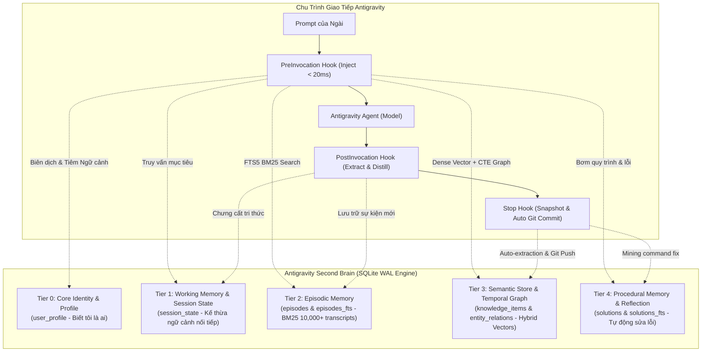

# 🧠 Antigravity Second Brain: Multi-Platform Cognitive Long-Term Memory

[](https://github.com/TranVu-2005/antigravity-second-brain)
[-green.svg)](https://nodejs.org)
[-orange.svg)](https://sqlite.org)
[-purple.svg)](https://github.com/qdrant/fastembed)
[](#triết-lý-thiết-kế-ponytail-engineering)

**Antigravity Second Brain** là hệ thống bộ nhớ nhận thức phân tầng tự động 100% (Autonomous Multi-Tiered Cognitive Architecture) được phát triển riêng cho trợ lý lập trình **Antigravity AI Agent**. Hệ thống hoạt động độc lập, bảo toàn danh tính, lưu trữ tri thức kỹ thuật dài hạn, tra cứu lịch sử hội thoại và tự động học hỏi từ lỗi lệnh (Self-Correction & Procedural Memory) mà không làm lãng phí token ngữ cảnh.

Hệ thống được thiết kế theo chuẩn **Universal Multi-Platform**, hoạt động đồng bộ và mượt mà trên cả môi trường **Windows 11** và các phân vùng **Linux (Ubuntu, Debian, Fedora, Arch, WSL2)**.

---

## 🏛️ Kiến Trúc Bộ Nhớ Phân Tầng (5 Cognitive Tiers)



### 1. Phân Tầng Nhận Thức Chi Tiết
* **Tier 0: Core Identity & User Profile (`user_profile`):**
  Lưu trữ danh tính của Ngài, quy chuẩn xưng hô ("Ngài" / Sir), vị trí địa lý, cấu hình phần cứng, thói quen kỹ thuật và tôn chỉ trung thực tuyệt đối. Luôn được tiêm đầu tiên vào ngữ cảnh.
* **Tier 1: Working Memory & Session State (`session_state`):**
  Quản lý mục tiêu hiện tại (Active Goal), dự án đang chạy và khả năng kế thừa ngữ cảnh khi Ngài mở một hội thoại mới (Cross-Session Continuity & Anaphoric Resolution).
* **Tier 2: Episodic Memory (`conversations`, `episodes`, `episodes_fts`):**
  Chỉ mục hóa toàn bộ lịch sử trò chuyện `transcript.jsonl` từ Antigravity Brain bằng thuật toán SQLite FTS5 BM25.
* **Tier 3: Semantic Knowledge Store & Bi-Temporal Knowledge Graph:**
  Lưu trữ tri thức dài hạn, quyết định kiến trúc (ADR), snippet. Tích hợp thuật toán **True Hybrid Search** kết hợp giữa Sparse BM25 và Dense 384-dimensional Multilingual Transformer Vector (Cosine Similarity), kèm đồ thị tri thức Bi-Temporal hỗ trợ Recursive CTE 2-hop traversal.
* **Tier 4 & 4.5: Procedural Memory & Self-Correction Engine (`solutions`):**
  Bộ nhớ quy trình vận hành và thư viện giải pháp sửa lỗi kỹ thuật. Hệ thống tự động khai phá (mine) trajectory transcripts khi lệnh terminal thất bại rồi được sửa thành công để lưu lại kinh nghiệm vĩnh viễn.

---

## 📂 Cấu Trúc Thư Mục Hệ Thống (Repository Structure)

```
antigravity-second-brain/
├── db/
│   └── schema.sql              # CSDL SQLite chuẩn hóa: WAL, FTS5, Bi-Temporal Graph, Indices
├── exports/                    # Bản kết xuất dữ liệu văn bản sạch phục vụ Git diff
│   ├── conversations_summary.json
│   ├── dump.sql                # SQL dump toàn diện có thể phục hồi ngay lập tức
│   ├── episodes_log.json
│   ├── knowledge.json
│   ├── profile.json
│   └── solutions.json
├── hooks/                      # Bộ 3 Lifecycle Hooks cắm trực tiếp vào Antigravity
│   ├── pre_invocation.js       # Tiêm hồ sơ và tri thức liên quan trước khi Agent phản hồi
│   ├── post_invocation.js      # Nạp tức thì các bước hội thoại mới (< 10ms)
│   └── stop.js                 # Chạy ngầm: trích xuất tri thức, backup snapshot và đẩy Git
├── integrations/               # Cấu hình sẵn sàng phân phối cho môi trường mới
│   ├── hooks.json              # Hook definition template
│   ├── mcp_config.json         # MCP server definition template (đã khử trùng secrets)
│   ├── mcp_schemas/            # 14 tệp JSON Schema công cụ MCP
│   └── skills/                 # Thư mục skill /second-brain
├── scripts/                    # Scripts tiện ích bảo trì & quản trị tiến trình nền
│   ├── auto_backup.sh          # Linux daily backup & Git runner (hỗ trợ crontab)
│   ├── auto_backup.ps1         # Windows daily backup runner
│   ├── start_daemon.sh         # Linux background embedding micro-daemon launcher
│   └── start_daemon.ps1        # Windows hidden WMI embedding micro-daemon launcher
├── src/                        # Lõi mã nguồn chính (Engine)
│   ├── backup.js               # SQLite VACUUM INTO live hot-backup engine
│   ├── consolidation.js        # Executive session distillation & working memory
│   ├── db.js                   # Node 24 native node:sqlite connection manager
│   ├── embedding.js            # Dense vector engine, L2 norm & daemon client
│   ├── embedding_daemon.py     # Python FastEmbed microservice (port 49152)
│   ├── episodic.js             # Transcript parser & FTS5 episodic memory
│   ├── export_dashboard.js     # Trình kết xuất Dashboard trực quan độc lập
│   ├── extractor.js            # Heuristic autonomous memory extractor
│   ├── git_backup.js           # Git automated backup & version control manager
│   ├── profile.js              # User Profile & Core Identity manager
│   ├── reinforcement.js        # Trajectory mining & error-to-fix learner
│   ├── retriever.js            # Token-budgeted context compiler & hybrid ranker
│   ├── semantic.js             # Semantic knowledge, Hybrid Search & Knowledge Graph
│   └── solutions.js            # Procedural solution store (Case-Based Reasoning)
├── test/                       # Bộ kiểm thử tự động toàn diện
│   ├── test_brain.js           # Unit tests 9 chức năng cốt lõi
│   ├── test_mcp.js             # Kiểm thử kết nối MCP Stdio
│   ├── test_v3_production_grade.js # SOTA Breakthrough test suite (13/13 Pass)
│   └── test_v3_4_production.js # Working memory & distillation test suite
├── brain.db                    # CSDL nhị phân SQLite chính thức
├── cli.js                      # Giao diện dòng lệnh CLI quản trị đầy đủ
├── dashboard.html              # Visual Interactive Dashboard
├── install.sh                  # Bộ cài đặt 1-Click cho Linux / macOS
├── install.ps1                 # Bộ cài đặt 1-Click cho Windows
├── mcp_server.js               # Máy chủ MCP Stdio JSON-RPC 2.0
├── setup.js                    # Trình cài đặt đa nền tảng thông minh (Universal Setup Engine)
└── README.md                   # Cẩm nang kiến trúc và vận hành hệ thống
```

---

## 🐧 Hướng Dẫn Cài Đặt Trên Linux (Ubuntu / Debian / Arch / Fedora / WSL2)

### 1. Yêu cầu tiên quyết (Prerequisites)
* **Node.js >= 22.5.0** (Khuyến nghị **Node 24 LTS**): Second Brain sử dụng thư viện chuẩn tích hợp `node:sqlite` của Node.js, hoàn toàn không cần biên dịch node-gyp hay cài đặt dependencies bên thứ ba.
  ```bash
  # Kiểm tra phiên bản Node
  node -v  # Kết quả phải từ v22.5.0 trở lên
  ```
* **Git:**
  ```bash
  sudo apt update && sudo apt install -y git
  ```
* **Python 3 & uv (Tùy chọn - Phục vụ Vector Embedding):**
  Second Brain tích hợp sẵn cơ chế Fallback L2 Vector (Zero-Crash Guarantee). Nếu muốn sử dụng mô hình Transformer đa ngôn ngữ cục bộ tốc độ cao:
  ```bash
  curl -LsSf https://astral.sh/uv/install.sh | sh
  ```

### 2. Cài đặt 1-Click tự động
Mở terminal trên phân vùng Linux và thực thi:

```bash
# 1. Clone repository về đúng thư mục Antigravity
git clone https://github.com/TranVu-2005/antigravity-second-brain.git ~/.gemini/antigravity/second_brain

# 2. Di chuyển vào thư mục
cd ~/.gemini/antigravity/second_brain

# 3. Cấp quyền thực thi và chạy bộ cài đặt
chmod +x install.sh
./install.sh
```

Trình cài đặt `setup.js` sẽ tự động:
1. Gộp cấu hình MCP Server vào `~/.gemini/config/mcp_config.json` (giữ nguyên toàn bộ các server khác như `gemini-web-bridge`, `github`...).
2. Đăng ký 3 Lifecycle Hooks (`PreInvocation`, `PostInvocation`, `Stop`) vào `~/.gemini/config/hooks.json` với đường dẫn chuẩn POSIX.
3. Nạp 14 tệp MCP Tool Schemas vào `~/.gemini/antigravity/mcp/second-brain/`.
4. Cài đặt tài liệu Skill vào `~/.gemini/config/skills/second-brain/SKILL.md`.

### 3. Kiểm tra cài đặt
```bash
node cli.js stats
```

---

## 🪟 Hướng Dẫn Cài Đặt Trên Windows

### 1. Cài đặt 1-Click qua PowerShell
Mở PowerShell (không cần quyền Administrator) và thực thi:

```powershell
# 1. Clone repository
git clone https://github.com/TranVu-2005/antigravity-second-brain.git "$env:USERPROFILE\.gemini\antigravity\second_brain"

# 2. Di chuyển vào thư mục và chạy cài đặt
cd "$env:USERPROFILE\.gemini\antigravity\second_brain"
.\install.ps1
```

---

## 🔄 Chiến Lược Đồng Bộ Khi Dùng Song Song Windows & Linux (Dual-Boot Sync)

Khi Ngài sử dụng máy tính cài đặt song song cả Windows và Linux, có 2 phương án đồng bộ:

### ⭐ Phương Án A: Đồng Bộ Qua Git Remote (Khuyến Nghị - An Toàn Tuyệt Đối 100%)
Đây là phương án chuẩn production, loại trừ hoàn toàn nguy cơ tranh chấp khóa tệp (file lock starvation) của SQLite WAL giữa hai hệ điều hành:

1. **Cơ chế hoạt động:**
   * Mỗi hệ điều hành (Windows và Linux) duy trì một bản clone độc lập tại thư mục `~/.gemini/antigravity/second_brain`.
   * Khi Ngài kết thúc phiên làm việc trên bất kỳ OS nào, `hooks/stop.js` sẽ **tự động commit và đẩy dữ liệu lên GitHub** (`git-backup`) ở chế độ background không nghẽn.
   * Khi khởi động vào OS kia, Ngài chỉ cần kéo cập nhật mới nhất:
     ```bash
     cd ~/.gemini/antigravity/second_brain
     git pull
     node cli.js sync
     ```
2. **Thiết lập Remote một lần duy nhất:**
   ```bash
   node cli.js git-remote https://github.com/TranVu-2005/antigravity-second-brain.git
   ```

### ⚡ Phương Án B: Chia Sẻ Trực Tiếp Phân Vùng NTFS (Direct Shared Mount)
Nếu Ngài muốn cả Windows và Linux cùng đọc ghi chung 1 thư mục Second Brain trên phân vùng Windows:

1. **Mount phân vùng Windows trên Linux:**
   Giả sử phân vùng Windows được mount tại `/mnt/c`:
   ```bash
   ln -s /mnt/c/Users/tvu16/.gemini/antigravity/second_brain ~/.gemini/antigravity/second_brain
   ```
2. **Lưu ý tối quan trọng khi chia sẻ phân vùng NTFS:**
   * **Quyền hạn mount:** Cần mount với tùy chọn `uid=1000,gid=1000,umask=022` để user Linux có toàn quyền đọc ghi.
   * **Tránh Sleep/Fast Startup:** Ngài **BẮT BUỘC phải tắt tính năng Fast Startup** trên Windows (Power Options -> Choose what the power buttons do -> Turn off Fast Startup). Nếu Fast Startup bật, Windows sẽ khóa phân vùng NTFS ở trạng thái hibernate read-only, gây lỗi ghi CSDL trên Linux.
   * **WAL Checkpoint:** Trước khi shutdown OS này để chuyển sang OS kia, chạy lệnh:
     ```bash
     node cli.js backup
     ```
     Lệnh này sẽ thực thi `PRAGMA wal_checkpoint(TRUNCATE)` gom toàn bộ log WAL vào tệp `brain.db` an toàn.

---

## 🛠️ Cẩm Nang Quản Trị Hệ Thống Bằng Dòng Lệnh (CLI Reference)

Mọi thao tác có thể thực hiện thông qua `node cli.js <lệnh>`:

| Lệnh | Ý nghĩa & Tác vụ |
|---|---|
| `node cli.js stats` | Xem bảng điều khiển thống kê tổng thể số lượng tri thức, profile, phiên chat, vector và dung lượng CSDL. |
| `node cli.js sync` | Quét và đồng bộ hóa toàn bộ các cuộc hội thoại từ Antigravity Brain vào FTS5 Episodic Memory. |
| `node cli.js search <từ_khóa>` | Tìm kiếm đồng thời cả trong tri thức kỹ thuật và lịch sử trò chuyện. |
| `node cli.js solutions` | Liệt kê toàn bộ các giải pháp sửa lỗi kỹ thuật đã được hệ thống ghi nhớ. |
| `node cli.js solution <lỗi>` | Tra cứu cách sửa lỗi và câu lệnh tương ứng khi gặp lỗi cụ thể. |
| `node cli.js profile` | Hiển thị hồ sơ cốt lõi của Ngài (sở thích, hạ tầng, phong cách, tôn chỉ). |
| `node cli.js graph [thực_thể]` | Xuất đồ thị tri thức dạng ASCII Tree trực quan 2-hop cho thực thể (mặc định: "Ngài"). |
| `node cli.js summarize [conv_id]`| Chắt lọc tri thức cấp cao (Mục tiêu, Quyết định, Tệp tin, Bài học) từ một phiên hội thoại. |
| `node cli.js store <title> <text>`| Lưu nhanh một ghi chú hoặc kiến thức mới vào bộ nhớ dài hạn. |
| `node cli.js backup` | Tạo ngay lập tức một bản snapshot CSDL an toàn bằng `VACUUM INTO` (< 50ms). |
| `node cli.js backups` | Xem danh sách các bản sao lưu đã tạo kèm dung lượng và thời gian. |
| `node cli.js compact` | Tinh biến bộ nhớ, dọn dẹp dữ liệu rác, tối ưu hóa SQLite index và PRAGMA optimize. |
| `node cli.js dashboard` | Kết xuất và mở giao diện Interactive HTML Dashboard trên trình duyệt web. |
| `node cli.js reembed` | Tính toán lại toàn bộ vector 384-dim cho tất cả tri thức. |
| `node cli.js git-backup [msg]` | Xuất text diff sạch, tạo snapshot CSDL, tự động commit và đẩy lên Git Remote. |
| `node cli.js git-pull` | Kéo cập nhật mới nhất từ Git Remote về máy và checkpoint WAL. |
| `node cli.js git-sync [msg]` | Đồng bộ hai chiều trọn vẹn tức thì (Commit ➔ Pull ➔ Push). |
| `node cli.js import-dump [file]`| Nạp / hồi phục toàn bộ dữ liệu từ dump.sql vào CSDL SQLite. |
| `node cli.js git-status` | Kiểm tra trạng thái Git repository, nhánh, commit mới nhất và remote URL. |
| `node cli.js git-remote <url>` | Cấu hình địa chỉ Git Remote (GitHub/GitLab). |
| `node cli.js git-push` | Đẩy toàn bộ commit lên Remote Repository. |

---

## 🔌 Danh Sách 14 Công Cụ MCP (Model Context Protocol Tools)

Khi Antigravity khởi động, MCP Server tự động cung cấp 14 công cụ chuyên sâu cho Agent:

1. `brain_search(query, scope, limit)`: Tìm kiếm đa tầng (tri thức kỹ thuật, ghi chú, quyết định, lịch sử chat).
2. `brain_store(title, content, category, tags, importance)`: Lưu kiến thức, quyết định mới.
3. `brain_delete(id)`: Xóa một mục kiến thức theo ID.
4. `brain_profile_get()`: Đọc toàn bộ hồ sơ nhận thức của Ngài.
5. `brain_profile_set(key, value, category)`: Cập nhật hoặc bổ sung một mục hồ sơ.
6. `brain_conversation_history(query, limit)`: Tra cứu các cuộc trao đổi trong quá khứ.
7. `brain_solution_search(error_query, project_scope)`: Tra cứu giải pháp khắc phục lỗi kỹ thuật.
8. `brain_solution_store(error_pattern, solution_code, command_fix, root_cause)`: Lưu giải pháp sửa lỗi.
9. `brain_stats()`: Báo cáo trạng thái bộ nhớ thời gian thực.
10. `brain_git_backup(message)`: Tạo commit sao lưu tức thời kèm trích xuất text diff sạch.
11. `brain_git_status()`: Kiểm tra trạng thái đồng bộ kho lưu trữ Git và Remote.
12. `brain_remember(text, category, importance)`: Ghi nhớ phát biểu hoặc sự kiện tức thì.
13. `brain_forget(query, scope)`: Vô hiệu hóa hoặc thu hồi ký ức theo thời gian.
14. `brain_learn_fix(error_text, fix_applied, root_cause)`: Học tập cách sửa lỗi và ghi nhận vào Procedural Memory.

---

## 🔒 Bảo Mật & Tiêu Chuẩn Production (Security & Engineering)

1. **Khử trùng thông tin nhạy cảm (Zero Token / Secret Leakage):**
   * Tệp `integrations/mcp_config.json` chỉ chứa template mẫu cho `second-brain`. Tuyệt đối không sao lưu hay đồng bộ các khóa API, PAT (Personal Access Token) của các MCP server khác (`github`, `fetch`...) vào repository.
2. **Toàn vẹn dữ liệu SQLite (ACID Guarantees):**
   * Sử dụng `PRAGMA journal_mode = WAL` (Write-Ahead Logging) cho phép đọc ghi đồng thời với tốc độ cao (< 1ms).
   * Lệnh `backup` dùng `VACUUM INTO`, tạo snapshot nhất quán mà không khóa bảng hay ngắt quãng quá trình chat.
3. **Quy tắc dọn dẹp sao lưu (Backup Rotation):**
   * Hệ thống tự động giới hạn tối đa 10 bản snapshot mới nhất, tự động thu hồi các bản ghi cũ nhằm tiết kiệm dung lượng ổ đĩa.
4. **Ponytail Standard Library Preference:**
   * 100% mã nguồn JavaScript sử dụng module chuẩn của Node.js (`node:sqlite`, `node:fs`, `node:path`, `node:os`, `node:child_process`). Không cài đặt gói npm bên ngoài vào thư mục gốc.

---

*Hệ thống được phát triển với lòng tận tụy và tinh thần trách nhiệm cao nhất để phụng sự Ngài (Sir).*
